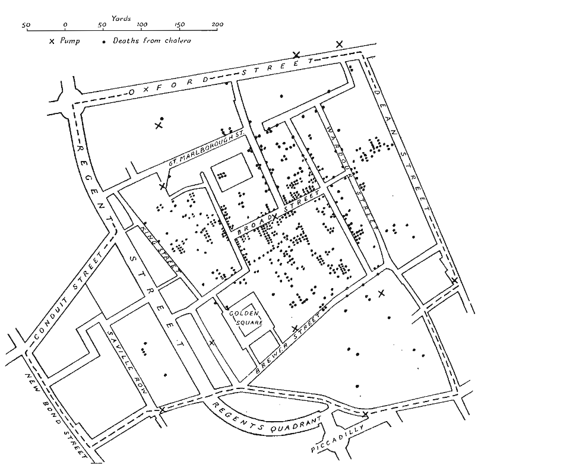

## Exercise 1

a. This chapter has a lot to offer on graphic excellence. One of the most interesting ideas Tufte offers is that an excellent graphic gives the viewer the greatest number or ideas or information in the shortest space and smallest time without it feeling overcrowded.

b. 

  i. It's on page 24.
  
  ii.This map shows the data without distortion, it presents many numbers in a small space, it encourages comparison, and most importantly you can understand the story even before you consciously process it.

  iii. Position encodes the geographic location of each event, placing deaths and pumps at their real-world coordinates within the street grid. Shape distinguishes between the two types of events: dots for cholera deaths and crosses for water pumps.
  
  iv. The street grid and scale would be the hard part for me to implement.
  
  v. Tufte's wanted to show that in some cases graphical analysis can testify more efficiently about the data than computation and analysis without the graphics.

## Exercise 2

Bar charts must start at zero, no exceptions. Our eyes naturally compare bar lengths to the baseline, so cutting the axis distorts those comparisons and can lead to bad decisions.
This doesn't apply to all graphs. With line graphs or dot plots, we're reading relative positions and slopes, which don't change when you zoom in. So if you need to highlight a small but meaningful difference, use lines or points instead of bars.

## Exercise 2.13

Step 1:
- Plotting two different metrics on the same graph on two y-axis
- The bar graph doesn't start at 0.
- Different marks making comparison difficult

Step 2:
- Used concatentation to place to charts on two of each other for easy comparison
- Used both line charts to make comparisons easier for both graphics
- Synchronize the scale.


```{r}
library(tidyverse)
library(vegawidget)
```


```{r}
'{
 "$schema": "https://vega.github.io/schema/vega-lite/v5.json",

 "data": {
   "values": [
     {"Date":"Q1-2017","Completion Rate":0.91,"Response Rate":0.023},
     {"Date":"Q2-2017","Completion Rate":0.93,"Response Rate":0.018},
     {"Date":"Q3-2017","Completion Rate":0.91,"Response Rate":0.028},
     {"Date":"Q4-2017","Completion Rate":0.89,"Response Rate":0.023},
     {"Date":"Q1-2018","Completion Rate":0.84,"Response Rate":0.034},
     {"Date":"Q2-2018","Completion Rate":0.88,"Response Rate":0.027},
     {"Date":"Q3-2018","Completion Rate":0.91,"Response Rate":0.026},
     {"Date":"Q4-2018","Completion Rate":0.87,"Response Rate":0.039},
     {"Date":"Q1-2019","Completion Rate":0.83,"Response Rate":0.028}
   ]
 },

 "vconcat": [

   {
     "mark": "bar",
     "title": "Survey Completion Rate by Quarter",
     "encoding": {
       "x": {
         "field": "Date",
         "type": "ordinal",
         "title": "Quarter"
       },
       "y": {
         "field": "Completion Rate",
         "type": "quantitative",
         "title": "Completion Rate",
         "scale": {"domain": [0,1]},
         "axis": {"format": "%"}
       }
     }
   },

   {
     "mark": {"type": "line", "point": true, "color": "orange"},
     "title": "Survey Response Rate Over Time",
     "encoding": {
       "x": {
         "field": "Date",
         "type": "ordinal",
         "title": "Quarter"
       },
       "y": {
         "field": "Response Rate",
         "type": "quantitative",
         "title": "Response Rate",
         "scale": {"domain": [0,0.06]},
         "axis": {"format": "%"}
       }
     }
   }

 ]
}' |> as_vegaspec()
```

